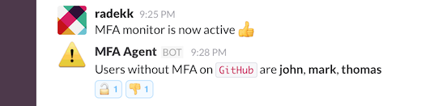
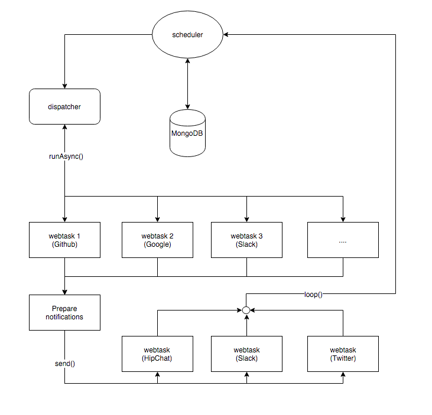

# Backendless TFA monitoring

Monitor your online applications without worrying about the hosting platform, bills, and servers. Run simple crontab task to oversee the actual state of the TFA among different websites like Github, Google, Slack and more.



## Requirements

- Node.JS basics
- Webtask CLI - [https://webtask.io/cli](https://webtask.io/cli)
- Webtask.io account (free) - [webtask.io](https://webtask.io)
- Mongolab account (free) - [mongolab](https://mongolab.com/)

## Compatibility

It works with every service that allows getting information about the TFA state over the API. I have implemented Github connector as an example, more coming soon.

## How it works

It leverages the quality of [webtask.io](https://webtask.io) which allows running Node.JS code inside an isolated environment. It is fast, secure, reliable and **FREE**.



## Step by step

### Create monitoring webtask (Github)

- ``<webtask.io_token_here>`` - it is your access token, here: [https://webtask.io/docs/api_auth](https://webtask.io/docs/api_auth)
- ``GITHUB_TOKEN`` - oAuth token with ``read:org`` privileges, [https://github.com/settings/tokens](https://github.com/settings/tokens)
- ``ORGANIZATION`` - it is a name of your organization on Github

```bash
# Github (service) webtask
curl -s https://webtask.it.auth0.com/api/tokens/issue \
-H "Authorization: Bearer <webtask.io_token_here>" \
-H "Content-Type: application/json" --data-binary \
'{"url":"https://raw.githubusercontent.com/radekk/webtask-tfa-monitor/master/webtasks/github/webtask.js","ectx":{"GITHUB_TOKEN":"...","ORGANIZATION":"..."}}'
```

As a result, you get a **token**. Modify ``scheduler.js`` file and add your service:

```javascript
var webtasks = [{
    name : 'GitHub',
    url  : 'https://webtask.it.auth0.com/api/run/...',
    token: '...'
}
```

Get the ``url`` parameter from documentation (generated dynamically for every user) here: [https://webtask.io/docs/api_run](https://webtask.io/docs/api_run)

### Create Mongolab account (500MB for free)

- Add new user
- Get your database connection string (replace user/password params inside URI)
- Your connection string is going to be handled by ``MONGO_URL`` secret

### Slack integration

- Add ``Custom integration -> Incoming WebHooks`` to your Slack account
- Get your ``Webhook URL``, it is going to be ``SLACK_WEBHOOK_URL`` secret
- Create channel for notifications (``SLACK_CHANNEL_NAME`` secret)

### Create notification webtask (Slack)

- ``<webtask.io_token_here>`` - it is your access token, here: [https://webtask.io/docs/api_auth](https://webtask.io/docs/api_auth)
- ``SLACK_WEBHOOK_URL`` - URL created as a result of Slack WebHook integration
- ``SLACK_CHANNEL_NAME`` - decide which channel is the most appropriate one for security notifications

```bash
# Slack (notification) webtask
curl -s https://webtask.it.auth0.com/api/tokens/issue \
-H "Authorization: Bearer <webtask.io_token_here>" \
-H "Content-Type: application/json" \
--data-binary '{"url":"https://raw.githubusercontent.com/radekk/webtask-tfa-monitor/master/notifiers/slack/webtask.js","ectx":{"SLACK_WEBHOOK_URL":"https://hooks.slack.com/services/...","SLACK_CHANNEL_NAME":"#alerts"}}'
```

As a result, you get a **token**. Save it (``RTM_WEBTASK_TOKEN``).

### Create a cron job

After creating all necessary webtasks you can run scheduler script:

```bash
wt cron schedule -n scheduler \
                 -s MONGO_URL="mongodb://..." \
                 -s RTM_WEBTASK_URL="https://webtask.it.auth0.com/api/run/..." \
                 -s RTM_WEBTASK_TOKEN="..." \
                 "* * * * *" \
                 "https://raw.githubusercontent.com/radekk/webtask-tfa-monitor/master/scheduler.js"
```

To check if cron job is working:

```bash
$ wt cron ls
Name:        scheduler
State:       active
Container:   wt-xxxxx-xxxxx
Schedule:    * * * * *
Last result: success
Last run:    2/29/2016, 1:04:13 AM
Next run:    2/29/2016, 1:05:00 AM
```

## License

MIT.
